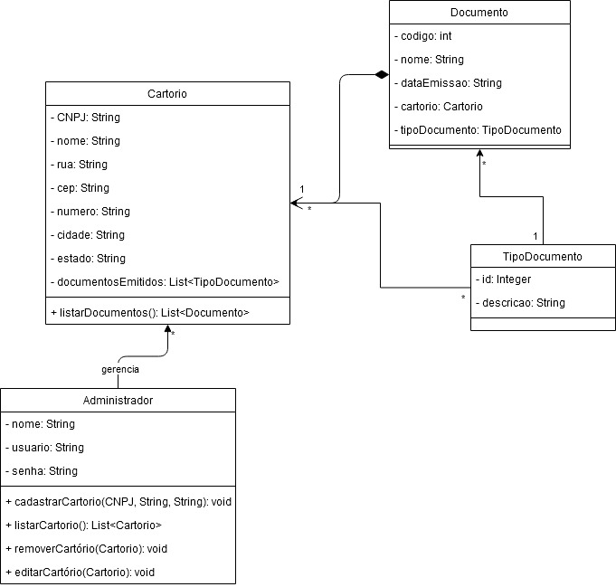
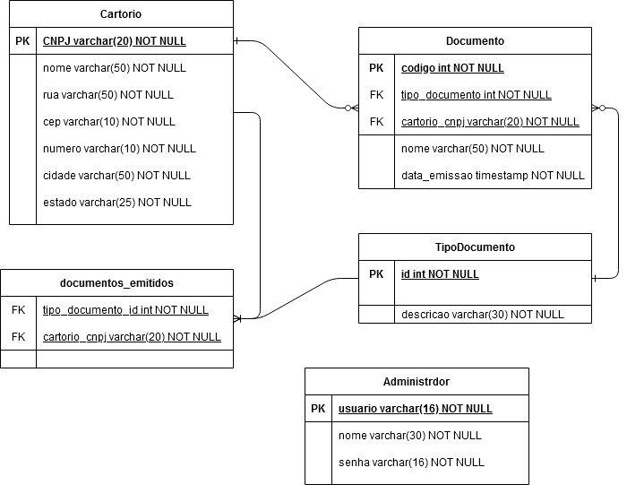

# Docket - Backend Challenge

## Visão Geral

O desafio consiste em criar uma API RESTful para gerenciar um sistema de cartório.

Para isto, foram utilizadas as seguintes tecnologias:

- Java 11.0.9
- Maven 3.6.3
- Spring Boot 2.4.1
- PostgreSQL 12.3

## Instruções

Para executar o projeto, execute os seguintes passos:

1. Clone o projeto

2. Altere as informações do Banco de Dados no arquivo **docket-backend-challenge/DocketBackend/src/main/resources/application.properties**

3. Entre no diretório **docket-backend-challenge/DocketBackend**

4. Execute o seguinte comando para buildar o projeto

```
mvn clean install
```

4. Execute o seguinte comando para startar o servidor

```
mvn spring-boot:run
```

### Utilizando a aplicação

Para utilizar o projeto é necessário utilizar um programa que emule o cliente, por exemplo o Postman.

Na aplicação cliente, selecione qualquer um dos métodos HTTP (GET, POST, PUT, DELETE) para consumir o servidor.

#### Endpoint - Cartorio

O Endpoint de Cartorio está disponível na seguinte URI

```
http://localhost:8080/api/cartorio
```

##### Endpoint - Documentos do Cartorio

O Endpoint de Documentos do Cartorio está disponível na seguinte URI

```
http://localhost:8080/api/cartorio/{nome_cartorio}/documento
```

##### Endpoint - Tipo de Documentos do Cartorio

O Endpoint de Tipo de Documentos do Cartorio está disponível na seguinte URI

```
http://localhost:8080/api/cartorio/{nome_cartorio}/tipo_documento
```

#### Endpoint - Documento

O Endpoint de Documento está disponível na seguinte URI

```
http://localhost:8080/api/documento
```

#### Endpoint - Administrador

O Endpoint de Administrador está disponível na seguinte URI

```
http://localhost:8080/api/administrador
```

#### Endpoint - Tipo de Documento

O Endpoint de Tipo de Documento está disponível na seguinte URI

```
http://localhost:8080/api/tipo_documento
```

## Exemplo de Requisições

### Cartorio

O conteúdo de um Cartorio possui o seguinte payload:

```json
{
    "cnpj": "00.111.222/0001-00",
    "nome": "Nome Fantasia",
    "rua": "Rua Fantasia",
    "cep": "99880-990",
    "numero": "123",
    "cidade": "Fortaleza",
    "estado": "CE",
    "documento_emitido": [
        {
            "id": 1,
            "descricao": "Certidão de Nascimento"
        },
        {
            "id": 2,
            "descricao": "Certidão de Casamento"
        }
    ]
}
```

### Documento

O conteúdo de um Documento possui o seguinte payload:

```json
{
    "nome": "Nome Fantasia",
    "dataEmissao": "2021-02-03 01:49:00",
    "tipoDocumento": { "id": id_tipo_documento,  "descricao": "Descricao tipo documento" },
    "cartorio":  {
        "cnpj": "00.111.222/0001-00",
        "nome": "Nome Fantasia",
        "rua": "Rua Fantasia",
        "cep": "99880-990",
        "numero": "123",
        "cidade": "Fortaleza",
        "estado": "CE",
        "documento_emitido": [
            {
                "id": 1,
                "descricao": "Certidão de Nascimento"
            },
            {
                "id": 2,
                "descricao": "Certidão de Casamento"
            }
        ]
    }
}
```

### Administrador

O conteúdo de um Administrador possui o seguinte payload:

```json
{
    "usuario": "Usuario do Administrador",
    "nome": "Nome do Administrador",
    "senha": "Senha do Administrador"
}
```

### Tipo Documento

O conteúdo de um Tipo de Documento possui o seguinte payload:

```json
{
    "id": id_tipo_documento,
    "descricao": "Descricao tipo documento"
}
```

## Diagramas

### UML



### DER

